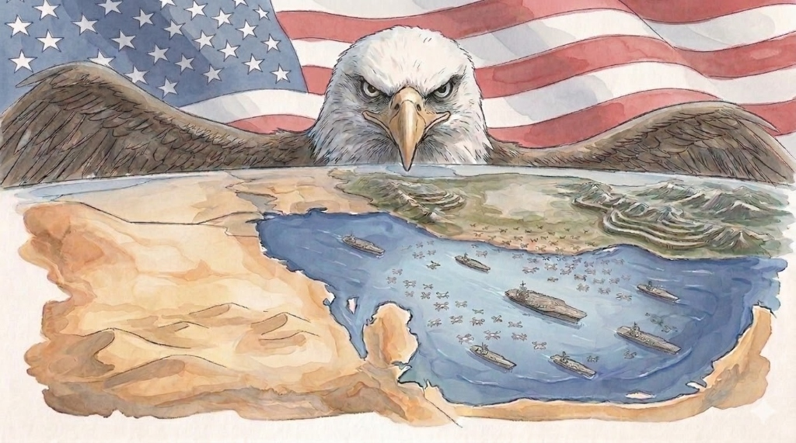

{style="width: 100%; border-radius: 8px; margin-bottom: 2rem;"}

**Abstract.** This article examines the structural conditions under which a sustained military confrontation between the United States and Iran would likely favor Iranian strategic objectives. It advances three interconnected arguments: that the cost-exchange asymmetry inherent in contemporary missile defense imposes unsustainable attrition costs on technologically superior adversaries; that the destruction of Gulf Cooperation Council (GCC) desalination infrastructure would produce cascading geoeconomic shocks capable of disrupting petrodollar recycling into dollar-denominated financial markets; and that domestic political incentives within the United States create structural biases toward escalation that are decoupled from rational strategic calculation. The article was drafted on 8 March 2026, prior to the June 2026 conflict. A postscript assesses which predictions were borne out by subsequent events.

---

## The Cost Problem of Modern Air Defense

The most analytically tractable expression of American strategic vulnerability in a conflict with Iran is the cost-exchange ratio between Iranian offensive capabilities and the interceptors used to neutralize them. Iranian Shahed-series drones, widely employed by proxy forces including the Houthis, cost between $20,000 and $50,000 per unit to manufacture. The interceptor missiles used against them — Patriot PAC-2 and PAC-3 variants, and the Israeli Iron Dome Tamir — cost between one and four million dollars per unit. This ratio, ranging from 20:1 to over 100:1 depending on the platform pairing, is structurally unsustainable in a high-volume threat environment.

This is not a novel observation. Analysts at the Center for Strategic and Budgetary Assessments and the Royal United Services Institute documented the same dynamic in Ukraine, where Russian saturation attacks demonstrated that even dense air defense networks can be overwhelmed through volume rather than precision. What distinguishes the Iranian case is the deliberate doctrinal choice to multiply volume through proxy networks at low marginal cost. The Houthis in Yemen, Hezbollah in Lebanon, and Shia militias in Iraq and Syria collectively allow Iran to open multiple fronts simultaneously without proportional investment. The American military apparatus, designed around the logic of superpower deterrence rather than asymmetric attrition, has no structurally adequate answer to this arithmetic.

The broader problem is one of institutional design. The American defense industrial base produces systems optimized for technological supremacy in high-intensity conventional warfare. That logic served its purpose during the Cold War. Against an adversary that has spent two decades calibrating its doctrine specifically to exploit the cost asymmetries of that model, it becomes a liability rather than an asset.

## The GCC's Structural Exposure

Western strategic assessments of a US-Iran conflict tend to focus on energy infrastructure — oil fields, tanker routes, the Strait of Hormuz — while underweighting a more fundamental vulnerability: water. GCC states collectively account for roughly half of global desalination capacity, and individual members rely on desalination for between forty and ninety percent of their fresh water supply. Saudi Arabia, with the largest desalination capacity in the world, concentrates most of that infrastructure along its Eastern and Western coastlines, within range of Iranian missile and drone systems.

A 2019 assessment by the King Abdullah Petroleum Studies and Research Center estimated that disruption of a major Riyadh desalination facility would exhaust urban water reserves within two to four weeks under normal consumption conditions. That timeline is not a secondary concern. It is the kind of threshold that forces governments into immediate crisis management rather than long-term strategic calculation, and it would almost certainly trigger a political and economic shock disproportionate to the military action that caused it.

The geoeconomic implications extend further. GCC sovereign wealth funds — including the Abu Dhabi Investment Authority, the Saudi Public Investment Fund, and the Kuwait Investment Authority — collectively manage assets in excess of three trillion dollars, a substantial share of which is invested in dollar-denominated instruments. The mechanism through which oil revenues are recycled into American financial markets is not incidental to the architecture of dollar hegemony; it is one of its load-bearing pillars. A sustained disruption to GCC export capacity would put pressure on these positions and, by extension, on the structural foundations that allow the United States to run persistent deficits without facing the adjustment costs that would apply to any other currency issuer. This dynamic has been analyzed in the existing literature on the petrodollar system, though its vulnerability to kinetic attack has received comparatively little serious attention.

## Why Washington Escalates Anyway

The structural case for American strategic caution in a conflict with Iran is well-established. The more difficult analytical question is why that case tends to be overridden. Three mechanisms are worth identifying.

The first is the psychology of early operational success. Historical cases of imperial overextension suggest that tactical gains in the early phases of a conflict generate political momentum toward escalation that consistently outpaces strategic deliberation. Robert Jervis's work on misperception in international relations, and the historical record documented by Barbara Tuchman, both point to the same pattern: decision-makers read early success as validation of a broader operational theory, and the institutional space for dissent narrows precisely when it is most needed.

The second mechanism is the structure of financial and political interests connecting Gulf state actors to American executive networks. The documented two-billion-dollar investment by Saudi sovereign wealth entities in a private equity vehicle associated with Jared Kushner, reported by The New York Times and confirmed through subsequent Congressional scrutiny, illustrates the degree to which Gulf financial interests have become embedded in the political networks of the American executive. Causal inference from financial ties to specific policy outcomes requires care, and this article makes no deterministic claim in that direction. What the structural conflict of interest does create is an asymmetric pressure environment in which the costs of alignment with GCC strategic preferences are systematically underweighted.

The third mechanism is institutional. A transition to large-scale ground operations activates war powers frameworks that expand executive authority over resource allocation, information management, and the pace of congressional oversight. Historically, these frameworks have outlasted the conflicts that generated them. The incentive to activate them is not purely military.

## Conclusion

The three arguments developed in this article — cost-exchange attrition, GCC infrastructure vulnerability, and the domestic political economy of escalation — do not individually constitute a decisive case. Each is contestable, and a complete analysis would need to model Iranian vulnerabilities with equal rigor, including the fragility of Iranian energy export infrastructure, the limits of proxy cohesion under sustained pressure, and the risk of escalation into qualitatively different strategic registers. The present article focuses on the American side because that is where the existing analysis has been most inadequate.

Taken together, however, the three arguments point to a consistent conclusion: the structural conditions for American strategic attrition in a conflict with Iran were in place well before any outbreak of hostilities. Whether those conditions would in fact produce the outcome described depends on variables — political leadership, escalation thresholds, third-party intervention — that no structural analysis can fully anticipate. What structural analysis can do is identify which side the weight of the underlying dynamics favors, and on that question, the answer was reasonably clear as of 8 March 2026.

